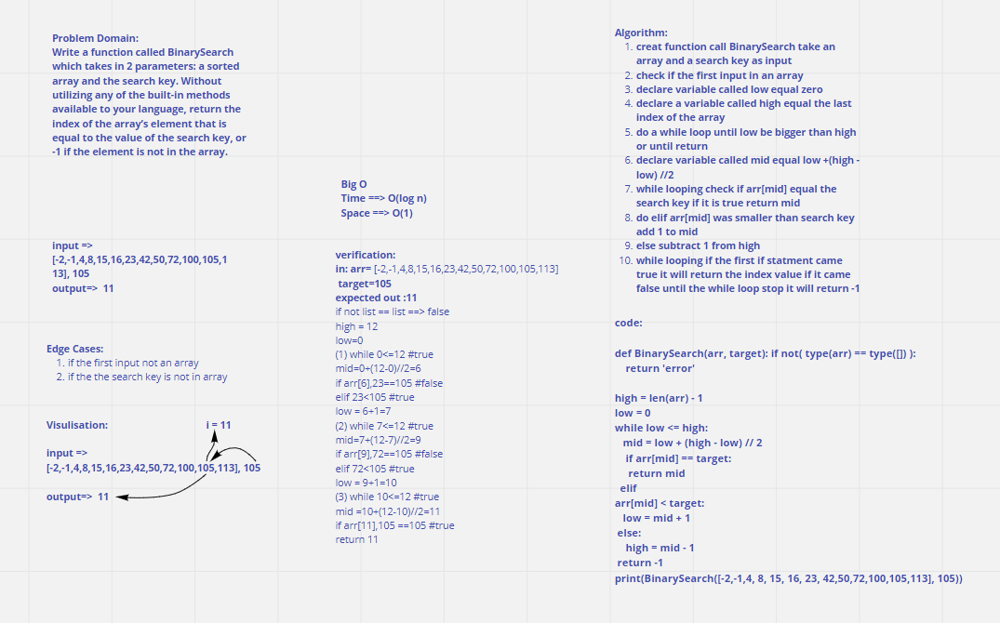

# Code ch 3

Function called BinarySearch which takes in 2 parameters: a sorted array and the search key, return the index of the array’s element that is equal to the value of the search key, or -1 if the element is not in the array.

## Whiteboard Process

## Approach & Efficiency

Create function call BinarySearch take an array and a search key as input, check if the first input in an array, Declare varible called low equal zero, Declare varbile called high equal the last index of the array, Do a while loop until low be bigger than high or until return, Declare varible called mid equal low + (high - low)//2 , while looping check if arr[mid] equal the search key if it is true return mid , do elif arr[mid] was smaller than search key add 1 to mid, else subtract 1 from high, while looping if the first if statment came true it will return the index value if it came false until the while loop stop it will return -1

Big O Time--> O(Log n)

Big O space--> O(1)
