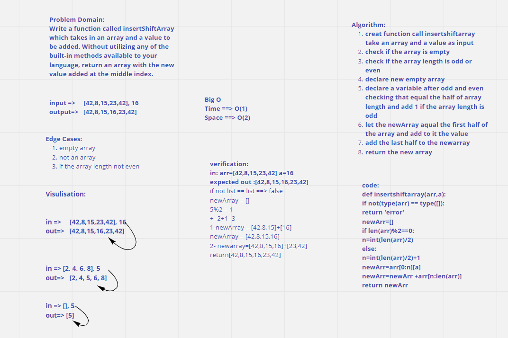

# code ch 2

Write a function called insertShiftArray which takes in an array and a value to be added. return an array with the new value added at the middle index.

# Whiteboard Process

## Approach & Efficiency

Create function call insertShiftArray take an array(arr) and a value(a) as input, at first the function the array is an array, declare new empty array, check if the array length is odd or even and declare new varible(t) equal the half of the array lengeth and add to it 1 if the lengeth of array is odd,let the newarray equal the first half of the array and add to it the value,add the the last half to the new array, at the end return the newarray

Big O Time--> O(1) Big O space--> O(n)
