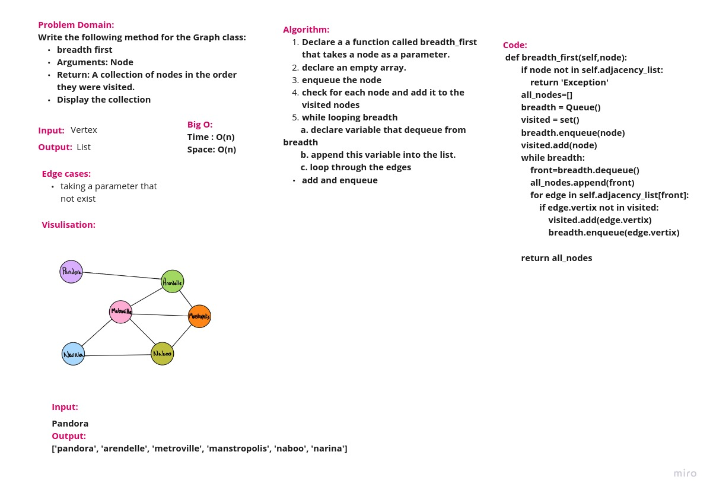

# Challenge Summary

Write the following method for the Graph class:

breadth first

Arguments: Node

Return: A collection of nodes in the order they were visited.

Display the collection

## Whiteboard Process

## Approach & Efficiency
Time : O(n)
Space : O(n)

## Solution
[solution](graph_breadth_first.py)
