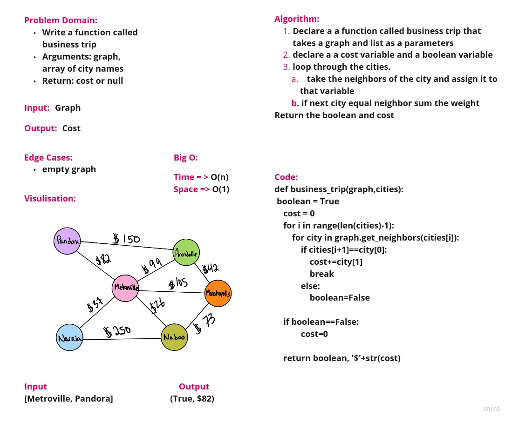

# Challenge Summary

Write a function called business trip

Arguments: graph, array of city names

Return: cost or null

## Whiteboard Process

## Approach & Efficiency

Big O

Time = > O(n)

Space => O(1)

## Solution

[solution](graph_business_trip.py)