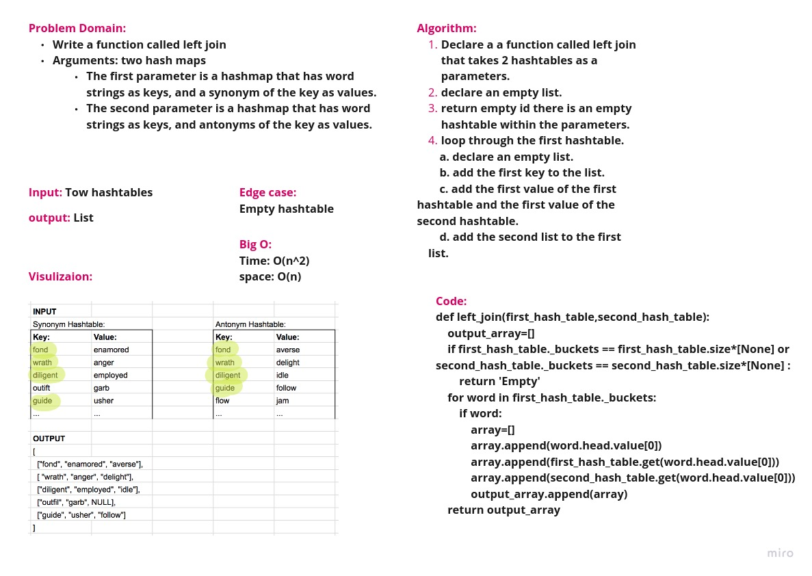

# Hashmap LEFT JOIN

Implement a simplified LEFT JOIN for 2 Hashmaps.

## Challenge

Write a function called left join

Arguments: two hash maps

The first parameter is a hashmap that has word strings as keys, and a synonym of the key as values.

The second parameter is a hashmap that has word strings as keys, and antonyms of the key as values.

Return: The returned data structure that holds the results is up to you. It doesn’t need to exactly match the output below, so long as it achieves the LEFT JOIN logic

## WhiteBoard

## Approach & Efficiency

Big O:

Time: O(n^2)

space: O(n)

## Solution

[solution](hashmap_left_join.py)