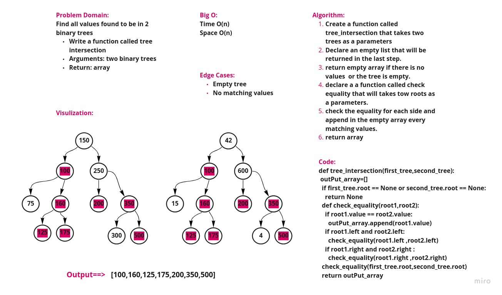

# Challenge Summary

Find all values found to be in 2 binary trees

Write a function called tree intersection

Arguments: two binary trees

Return: array

## Whiteboard Process

## Approach & Efficiency

Big O :

* Time O(n)

* Space O(n)

## Solution

[solution](tree_intersection.py)