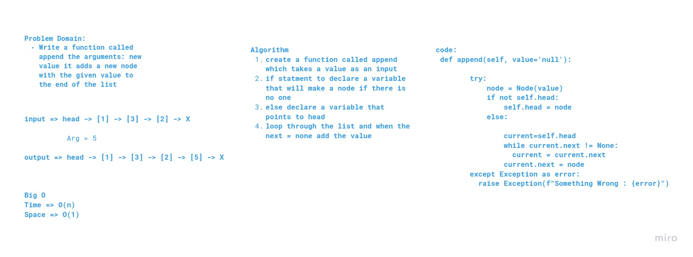
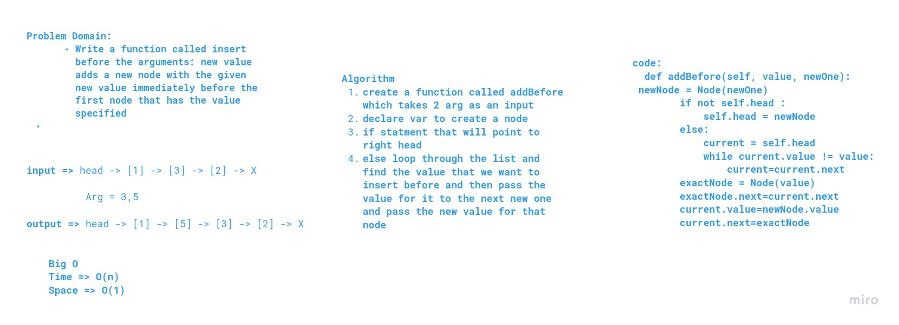
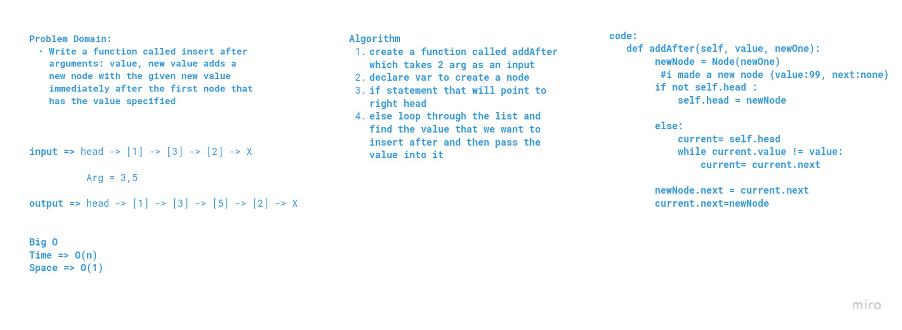

# Challenge Summary

1. Create a Node class that has properties for the value stored in the Node, and a pointer to the next Node.

2. Create a Linked List class

3. Within your Linked List class, include a head property.
Upon instantiation, an empty Linked List should be created.
The class should contain the following methods

* insert

* includes

* to string

* append

* add before

* add after

## Approach & Efficiency
What approach did you take? 

declaring function and then debugging :)

insert 

 time : O(1) 

 space : O(1)

 includes : 

time : O(n) 

space : O(1)

append :

time : O(n) 

space : O(1)

to string: 

time : O(n) 

space : O(n)

insertAfter : 

time : O(n) 

space : O(1)

insertBefore : 

time : O(n) 

space : O(1)

## Solution

[link](linked_list.py)

## whiteboards

