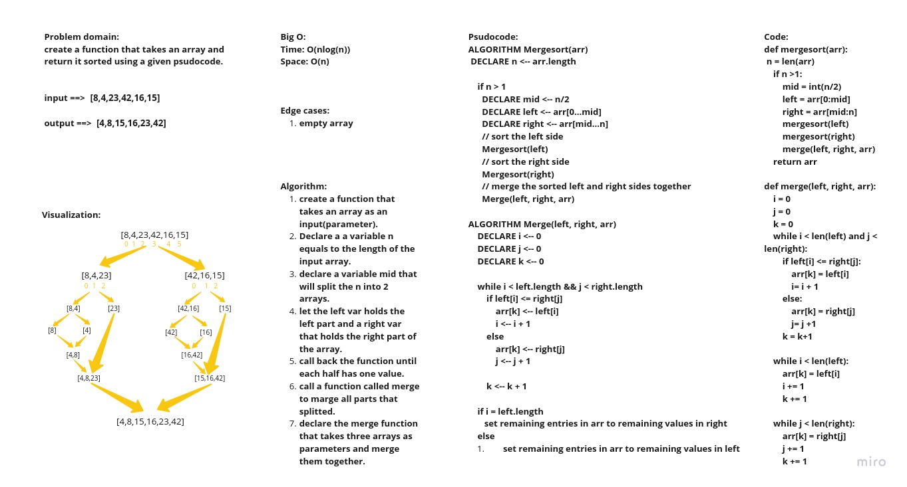

# Challenge Summary:

create a function that takes an array and return it sorted using a given psudocode.

## Whiteboard Process

## Approach & Efficiency

Big O :
Time: O(nlog(n))
space: O(n)

## Solution

[solution](merge_sort.py)
