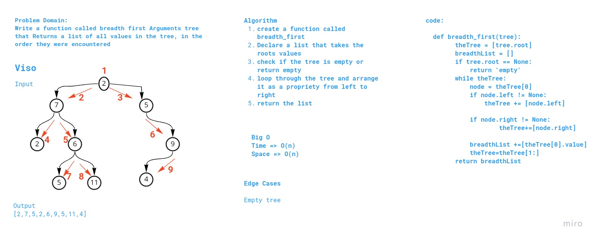

# Problem Domain:

Write a function called breadth first Arguments tree that Returns a list of all values in the tree, in the order they were encountered

# Whiteboard Process

# Approach & Efficiency

Big O :

Time--> O(n)
space--> O(n)

# Solution 

[link](tree-breadth-first.py)